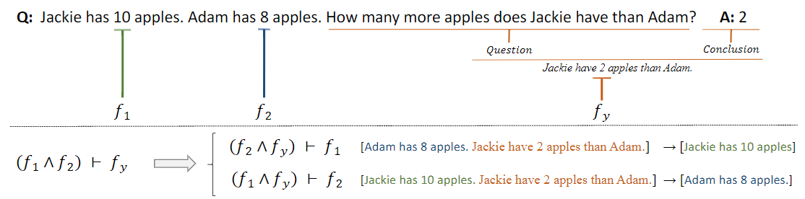

# Large Language Models are reasoners with Self-Verification

This is the official implementation of `Large Language Models are reasoners with Self-Verification`.



## Installation
Make sure you have Python>=3.8 installed on your machine.
```
pip install torch==1.8.2+cu111 torchtext==0.9.2 -f https://download.pytorch.org/whl/lts/1.8/torch_lts.html
pip install tqdm transformers sklearn pandas numpy sentencepiece openai
```

## Set your OpenAI API key
```
# https://beta.openai.com/account/api-keys
export OPENAI_API_KEY=(YOUR OPENAI API KEY)
```

## Set arguments.
```
model=CODEX # {"gpt3", "gpt3-medium", "gpt3-large", "gpt3-xl", "CODEX", "CODEX-001"}. "codex" is the smallest model.
dataset=multiarith # We can use other datasets. See help for the details.
api_time_interval=4.0 # Caution. The API allows users request API up to 20 times in a minutes, otherwise errors happen.
```

## Quick Start

### Self-Verification (our proposal)
```
python main.py --method=verifier_cot --model=${model} --dataset=${dataset}
```

### CoT
```
# MultiArith and GSM8K are currently available.
python main.py --method=few_shot_cot --model=${model} --dataset=${dataset}
```


## Method


1. Forward Reasoning, the LLM generates candidate thought chains and conclusions for a given problem text; 
2. Backward Verification, we use the LLM to verify whether the conditions meet the candidate conclusions and rank the candidate conclusions based on a verification score.


## Cite

> ```
> @article{weng2022verification,
>   title={Large Language Models are reasoners with Self-Verification},
>   author={Weng, Yixuan and Zhu, Minjun and He, Shizhu and Liu, Kang and Zhao, Jun},
>   journal={arXiv preprint arXiv:2212.09561},
>   year={2022}
> }
> ```
